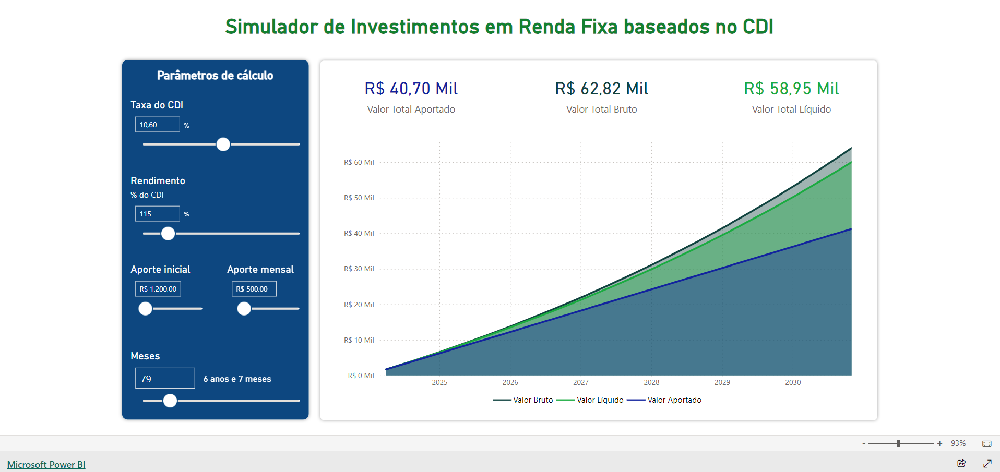

# Simulador de investimentos de renda fixa com Power BI

O objetivo deste projeto é treinar o desenvolvimento de medidas DAX complexas e a utilização de parâmetros para interação do usuário com relatórios do Power BI.

## Recursos utilizados

- Parâmetros para inserção dos seguintes dados:

  - Taxa do CDI;
  - Rendimento (% do CDI que este investimento rende);
  - Aporte inicial;
  - Aporte mensal;
  - Tempo de investimento em meses.

- Medidas DAX para calcular os seguintes valores:
  - Total dos aportes;
  - Total bruto (aportes + rendimentos);
  - Total líquido (total bruto - imposto de renda progressivo).

---

Clique na imagem abaixo para acessar o relatório.

